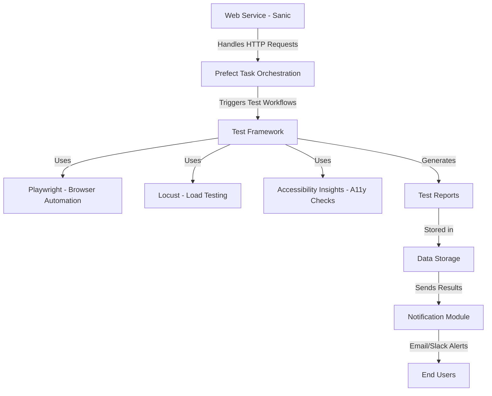

# 测试工具

## 概述

编写测试用例（开发测试脚本），准备测试数据导入工具，组成测试套件（创建测试配置），在本地、远端执行测试用例（脚本），收集测试日志，输出测试报告，发出测试结果通知。支持集成 CI/CD流程，记录简单的测试终端访问信息，差异性。

## 场景范围

1. 交互功能
2. 访问性能
3. 安全渗透
4. Accessibility
5. 系统兼容性
6. 支持打包 wheel, exe
7. 可以集成CI/CD
8. 社区测试模块，测试用集成
9. 热门应用测试报告面板（悬赏）--可授权隐私安全通道访问和执行测试验证
   
## 基础功能

1. 管理测试用例
   1. 增删，同步脚本 git 库
2. 管理测试数据
   1. 导入 csv(最简单的带表头的excel), txt
   2. 数据源（数据库、存储）
   3. 数据生成-AI
3. 测试套件（配置Tomal）
   1. 配置表单数据保存为 tomal/json 文件
   2. 任务（Job flow）启停，状态反馈
   3. TODO list 定时任务计划
4. 测试工具插件(lib)
5. 日志，报告，通知
   1. 文件存储，导出，上传
6. CI-CD
   1. web hook API
7. 测试终端信息表
   1. 设备远程管理信息-增删改查
   2. 在线状态检测
8. A/B Test and Release
9. 账号密码

## 系统框架结构

Simple Example: Testing Workflow

    Trigger: Sanic API endpoint calls Prefect to start a test flow.

    Execution:

        Playwright runs UI tests on Chrome/Firefox.

        Locust simulates 1,000 concurrent users.

        Accessibility Insights scans for ARIA role errors.

    Reporting:

        Results saved to data/reports/.

        Notification module alerts the team via Slack if issues arise.

This architecture balances scalability (Prefect + Sanic), comprehensive testing (Playwright + Locust + A11y), and automation (reports + notifications).

* web服务  sanic
* 任务流程管理 prefect 
* 测试框架 pytest+playwright
* 测试工具 
  + playweigth
  + locust 
  + Accessibility Insights
* 数据存取
  + 测试构造数据
  + 测试生成报告
* 通知模块 

